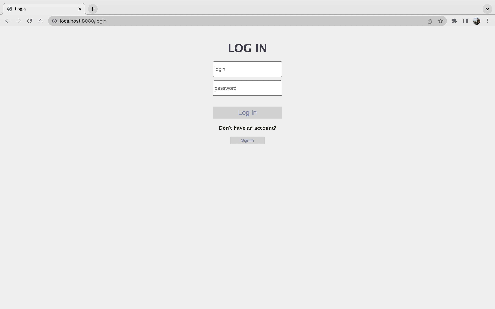
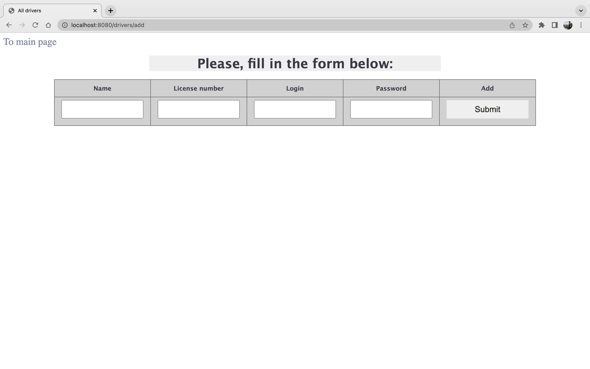
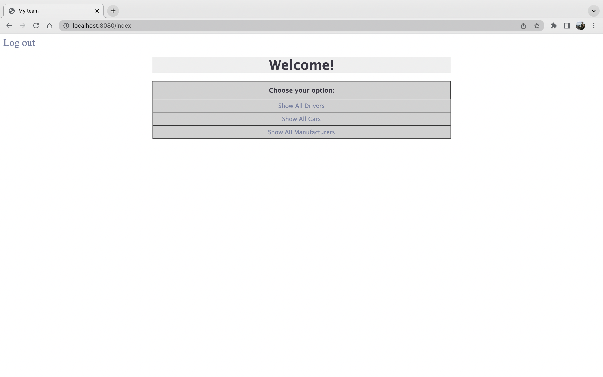
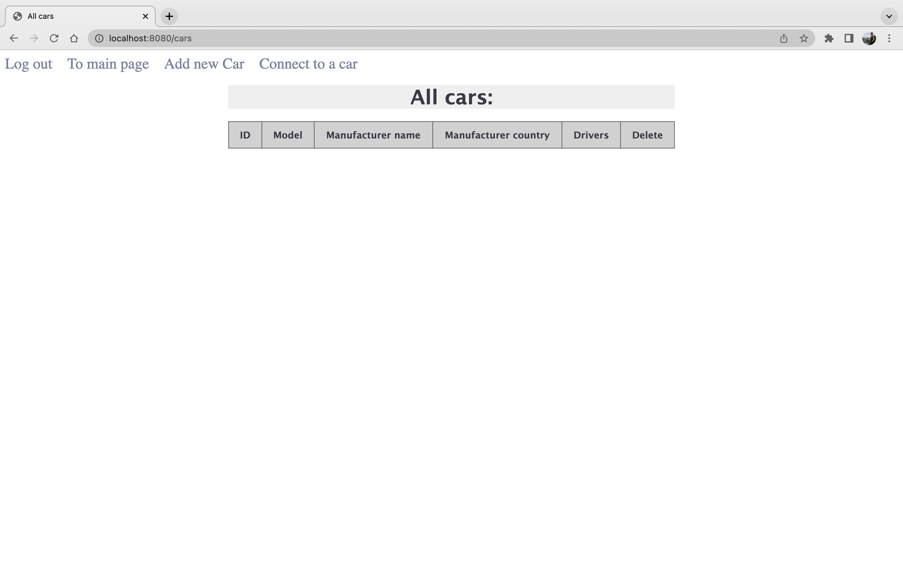
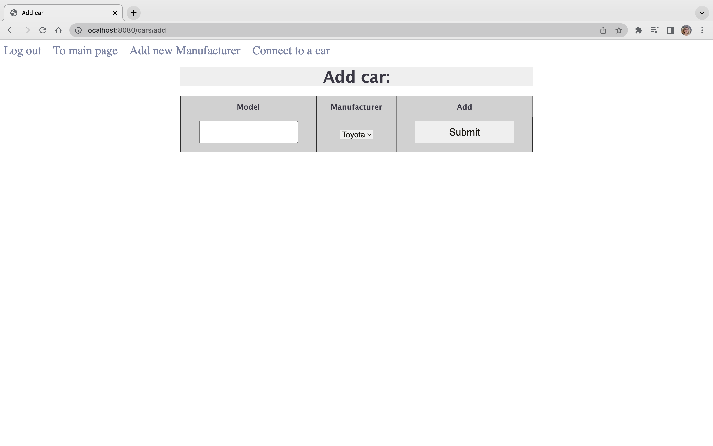
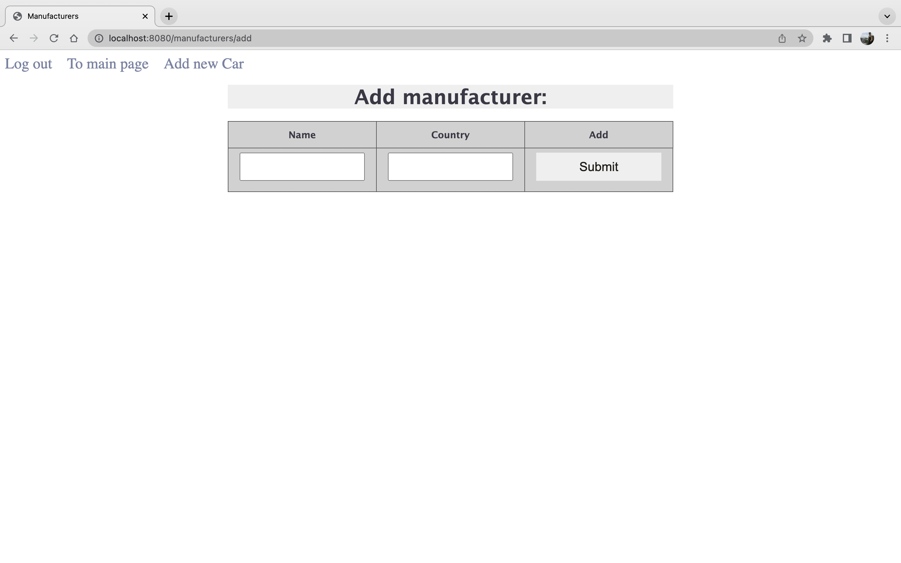
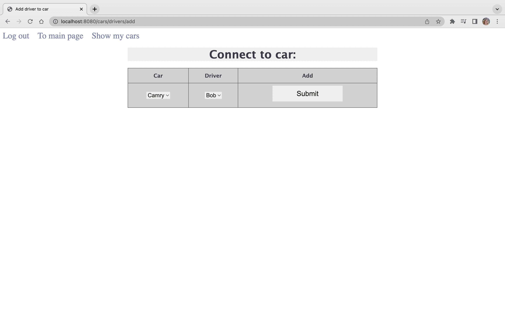
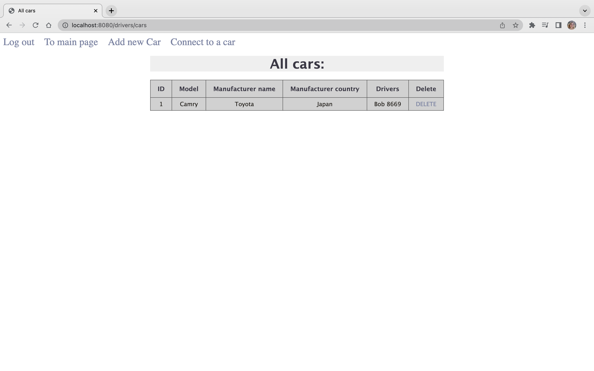

# TAXI SERVICE

### This project is designed to imitate the work of the simple taxi service app with driver authentication
During the first launch you’re granted access to:
- login page for previously authorized users
- registration page

#### After registration, feel free to test full app functionality. Such as:
- creating manufacturers
- creating cars, using the list of existing manufacturers
- connecting drivers to cars, using related lists of options
- displaying all manufacturers, cars, or drivers
- displaying cars exclusively for the authorized drivers
- deleting manufacturers, cars, or drivers
---
### The diagram below represents connections, built inside this app

### Implementation details

#### Project is based on 3-layered architecture:

- Data access layer (DAO)
- Application layer (service)
- Presentation layer (controllers)

#### Technologies:
- Apache Tomcat (v9.0.50)
- MySQL
- JDBC
- Servlet
- JSP
- JSTL
- HTML, CSS
- Maven
- Maven Checkstyle Plugin
---
### Run Project

#### Tools to run this project:

- IntelliJ IDEA Ultimate IDEA
- ApacheTomcat Tomcat
- MySQL and MySQL Workbench MySQL

1. Clone the project on your IDE
2. In MySQL Workbench run the script from resources/init_db_my.sql

Warning!!! if you already have a database named "taxi", this script will delete it and create a new database with the same name.

3. In src/main/java/taxi/util/ConnectionUtil change URL, USERNAME and PASSWORD with your data. JDBC Driver is already provided, but you can change it with a more suitable as well
4. In the src/main/resources/log4j2.xml at line File name = "File" fileName = "logs\app.log" replace "logs\app.log" with absolute path to .log file
5. Configure TomCat Local server
   (Add New Configuration -> TomCat -> Local -> Fix -> taxi-service:war exploded -> OK)
---
### Login page:

### Registration page:

### Main menu:

### After choosing to show all available cars you have an option to create a new car

### Here you can create new car, using existing manufacturers, or create a new manufacturer first

### Now you can connect driver to a car and display cars, available for current driver

